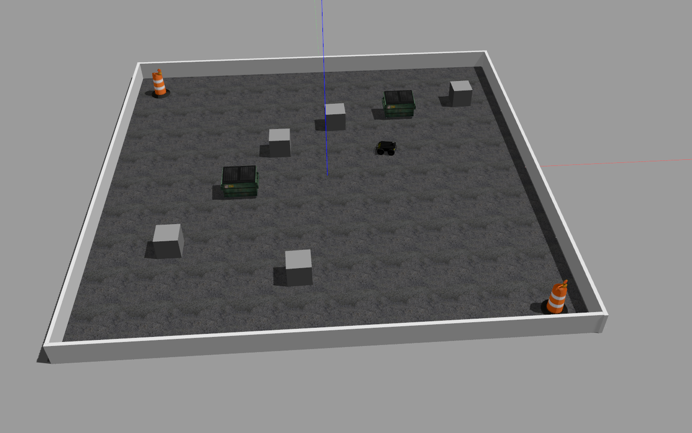
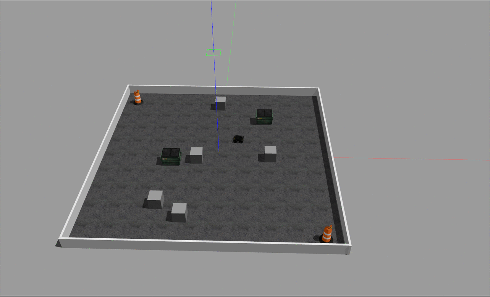
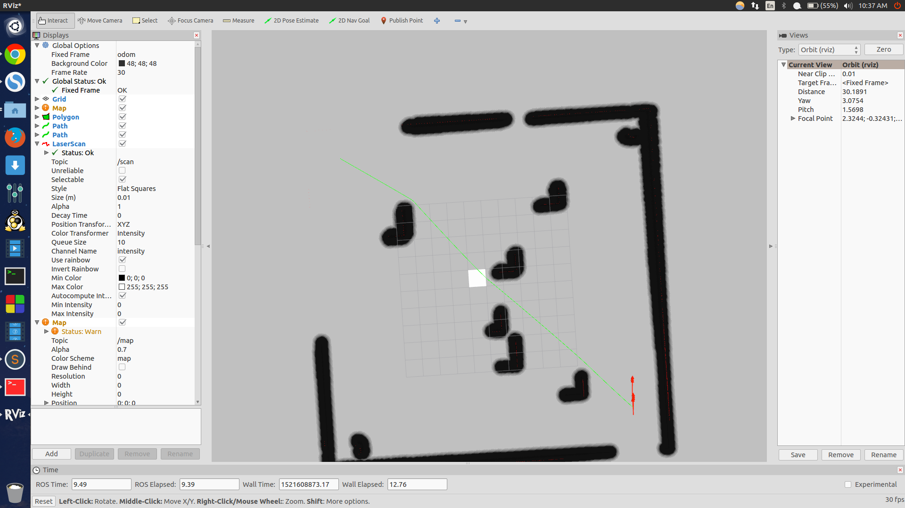

# RL experiments on Husky integrated with OpenAI gym  

## Getting Started

These instructions will get you a copy of the project up and running on your local machine for development and testing purposes.   

## Requirement
* ROS Indigo   
* Gazebo 7  


## Build and install gym-gazebo
  
* Install the gym-gazebo following the [installation instructions](https://github.com/hari-sikchi/gym-gazebo/#installation) given in the repository.    

For installation on ROS Indigo:-   
1. Getting the ros packages necessary for our experiments 

Get the following packages individually from their git respository(**indigo branch**) and replace/insert(if not already present) them in the `<INSTALLATION_ROOT>/gym_gazebo/envs/installation/catkin_ws/src/` directory.  
  * [ar_track_alvar_msgs](https://github.com/sniekum/ar_track_alvar_msgs)   
  * [ecl_core](https://github.com/stonier/ecl_core/tree/release/0.61-indigo-kinetic)  
  * [ecl_navigation](https://github.com/stonier/ecl_navigation/tree/release/0.60-indigo-kinetic)  
  * [ecl_tools](https://github.com/stonier/ecl_tools/tree/release/0.61-indigo-kinetic)  
  * [ecl_lite](https://github.com/stonier/ecl_lite.git)  
  * [mav_comm](https://github.com/ethz-asl/mav_comm)  
Now, for the husky environment we require packages provided by Clearpath Robotics for model import.  
  * [husky](https://github.com/husky/husky)  
	Note: Replace the urdf and launch files in husky/husky_description with those given in additional_packages/husky_description.  
  * Copy all the packages given in the additional_packages folder in the path `<INSTALLATION_ROOT>/gym_gazebo/envs/installation/`  
  * Navigate to `<INSTALLATION_ROOT>/gym_gazebo/envs/installation/catkin_ws/`  
  * Run `catkin_make`
    
2. Getting the plugins ready.  

  * The plugins for gazebo world allow us to define behaviour in gazebo world(Random pose, Random velocity of obstacles, etc).  
  * Plugins required for our experiment are located in `<INSTALLATION_ROOT>/gym_gazebo/envs/husky/husky_plugin` .
    Run the following commands to build the plugin. *For more details regarding usage, see the README in the `husky_plugin    `folder.*  
    
    ```
    mkdir build
    cd build
    cmake ..
    make
    ```  
    
  c. Add the following line to your bashrc.(Set the path for compiled plugins)  
  ```
  export GAZEBO_PLUGIN_PATH=${GAZEBO_PLUGIN_PATH}:<INSTALLATION_ROOT>/gym_gazebo/envs/husky/husky_plugin/build 
  
  ```
 

## Running the experiments  
  
  ```
    cd <INSTALLATION_ROOT>/examples/husky    
    python husky_reactive_control_qlearn.py  
  ```
  
  
| Name | Middleware | Description | Observation Space | Action Space | Reward range |
| ---- | ------ | ----------- | ----- | --------- | -------- |
| `GazeboHuskyWallMovingObstacles-v0` | ROS | | Continous | Continuos | |
| `GazeboHuskyReactiveControlEnv` | ROS | | Discrete | Discrete | |

  
## Visualize the Learning Process
<p align="center"></p>


<p align="center"></p>

*****
